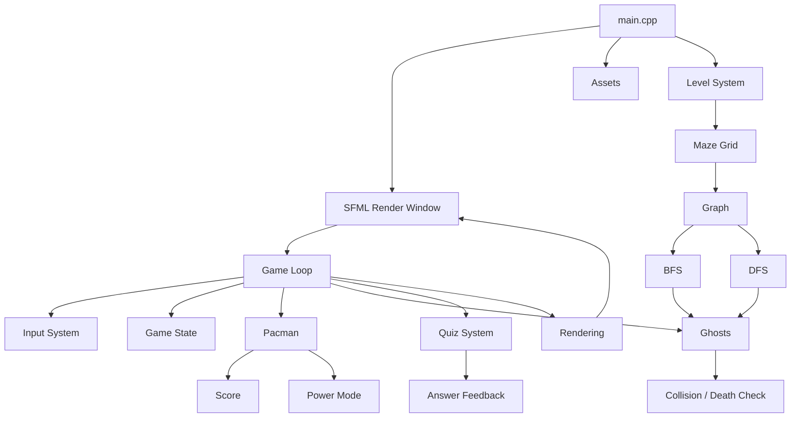
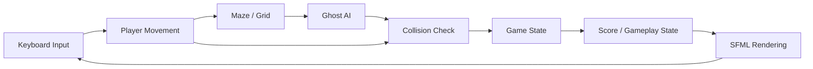

<div align="center">

# 👹 PACMAN — DEMON REALM

### *Enter the realm. Outsmart the demons. Survive the maze.*

<br>


<br><br>


<br>

**A dark supernatural Pacman-inspired game where classic arcade gameplay meets Data Structures & Algorithms.**

[ 🎮 Gameplay ](#-gameplay) •
[ 🧠 DSA Engine ](#-the-demon-engine--dsa-under-the-hood) •
[ 👹 Demons ](#-demon-codex) •
[ 🏰 Architecture ](#-demon-realm-architecture) •
[ ⚙️ Installation ](#️-installation)

</div>

---

# 🌑 Welcome to the Demon Realm

The maze is no longer an ordinary arcade labyrinth.

Something darker lives inside it.

**PACMAN — DEMON REALM** is a C++/SFML game project that combines real-time gameplay with practical Data Structures and Algorithms.

The player moves through a supernatural maze while enemy demons use different movement strategies to pursue and navigate the player.

Behind the visual gameplay is a collection of DSA concepts including:

- 🗺️ Graph-based maze representation
- 🔵 Breadth-First Search
- 🔴 Depth-First Search
- 📦 Queue
- 🧱 Stack
- 🔗 Node-based data structures
- 🎮 Game-state management
- 🧩 Grid-based movement
- ⚡ Power mode
- ❓ Interactive quiz system

The goal was not simply to implement algorithms.

The goal was to make those algorithms **playable**.

---

# 🎮 Game Overview

<div align="center">

| 👹 DEMON REALM | 🧠 DSA ENGINE | ⚔️ SURVIVAL |
|:---:|:---:|:---:|
| Dark supernatural Pacman-inspired world | BFS, DFS, graphs, queues & stacks | Navigate the maze while avoiding demons |
| Multiple playable levels | Algorithms directly influence gameplay | Collect maze items and survive |
| Character selection | Real algorithms behind enemy movement | Score and progression system |

</div>

---

# 🌌 The Core Experience

### 🗺️ Explore the Maze

The game world is represented as a grid containing walls, walkable cells, special cells and the demon area.

The player navigates through the maze using keyboard controls.

### 👹 Survive the Demons

Three different enemy movement approaches are implemented.

Each demon can behave differently because its movement logic is based on a different algorithm or strategy.

### ⚡ Enter Power Mode

Special maze cells can trigger the game's power-mode system, changing the gameplay state while the player continues navigating the maze.

### ❓ Face the Quiz

The game also contains an interactive question system.

When a quiz becomes active, gameplay movement is paused while the player responds using keyboard choices.

### 🏆 Progress Through the Realm

The project contains **5 levels**.

The game also contains a dedicated Level Select interface, allowing the player to select a level before entering gameplay.

---

# 🎥 Gameplay Showcase

## 🌑 Enter the Realm

Add the game's menu screenshot here:

```text
assets/menu.png
```


---

## 🎮 Gameplay

Add a gameplay screenshot or GIF:

```text
assets/gameplay.gif
```


> **Tip:** A short 5–10 second gameplay GIF showing Pacman moving while the demons chase him will make the repository immediately more impressive.

---

## 👹 The Demon Hunt

Add a screenshot showing Pacman and the three enemies:

```text
assets/demon-hunt.png
```


---

## ⚡ Power Mode

Add a screenshot showing the player during power mode:

```text
assets/power-mode.png
```


---

# 👹 Demon Codex

Three different ghost movement systems are present in the game.

| Demon | Movement Strategy | Role |
|---|---|---|
| 👹 Demon I | **BFS** | Pathfinding / pursuit |
| 👁️ Demon II | **DFS** | Maze exploration |
| 🌀 Demon III | **Random Movement** | Unpredictable movement |

---

## 🔵 Demon I — The Pathfinder

### BFS

The first ghost uses **Breadth-First Search**.

The maze is treated as a graph, allowing BFS to explore neighboring cells level by level.

Conceptually:

```text
             PACMAN
                ▲
                │
          shortest route
                │
                │
       ┌────────┴────────┐
       │                 │
     Node              Node
       │                 │
     Node              Node
       │
     GHOST
```

BFS is useful here because it can find a shortest path in an unweighted grid.

---

## 🔴 Demon II — The Explorer

### DFS

Another ghost uses **Depth-First Search**.

Instead of exploring the maze level-by-level, DFS follows a path deeper into the available graph before backtracking.

```text
START
  │
  ▼
 Node
  │
  ▼
 Node
  │
  ▼
 Node
  │
  ├──── blocked
  │
  ▼
 Node
  │
 BACKTRACK
  │
  ▼
 NEXT PATH
```

This creates a different movement behavior from the BFS-based enemy.

---

## 🌀 Demon III — The Wanderer

The third ghost uses a random movement strategy.

Instead of calculating a shortest route, it chooses valid movement options to create a less predictable enemy.

This provides a different gameplay challenge from the algorithm-driven ghosts.

---

# 🧠 THE DEMON ENGINE — DSA UNDER THE HOOD

The most important part of the project is what happens underneath the visuals.

The game turns classical DSA concepts into actual gameplay mechanics.

---

# 🗺️ 1. Graph

The maze can be represented as a graph:

```text
             ┌───────┐
             │ Node  │
             └───┬───┘
                 │
        ┌────────┼────────┐
        ▼        ▼        ▼
     ┌─────┐  ┌─────┐  ┌─────┐
     │Node │  │Node │  │Node │
     └──┬──┘  └─────┘  └──┬──┘
        │                  │
        ▼                  ▼
     ┌─────┐            ┌─────┐
     │Node │────────────│Node │
     └─────┘            └─────┘
```

Each walkable position can be treated as a node, while possible movements between positions form connections.

The project contains a dedicated:

```text
Graphs.cpp
```

for graph-related functionality.

---

# 🔵 2. Breadth-First Search

BFS is used by the pathfinding ghost.

### Concept

```text
START
  │
  ▼
LEVEL 0

  ●
 / \
●   ●
|   |
●   ●
 \ /
  ●

LEVEL 1
LEVEL 2
LEVEL 3
```

BFS explores the graph layer-by-layer.

For an unweighted maze:

```text
Time Complexity: O(V + E)
```

where:

- `V` = number of vertices/nodes
- `E` = number of edges/connections

The actual game implementation is contained within the AI/ghost systems.

---

# 🔴 3. Depth-First Search

DFS is used for another ghost movement strategy.

Conceptually:

```text
START
  │
  ▼
  A
  │
  ▼
  B
  │
  ▼
  C
  │
  ▼
  D
  │
  └──── BACKTRACK
```

DFS explores one branch deeply before returning to another available branch.

Typical complexity:

```text
Time: O(V + E)
```

The project contains DFS-related functionality in the AI/graph systems.

---

# 📦 4. Queue

BFS requires a queue to maintain the order in which nodes are explored.

The project contains:

```text
QueueStack.cpp
```

which provides custom queue/stack functionality used by the game's algorithm systems.

Conceptually:

```text
ENQUEUE

[ A ][ B ][ C ][ D ]
  ↑
 FRONT

              REAR
                ↑
```

Nodes are processed in the order they are discovered.

---

# 🧱 5. Stack

DFS naturally uses stack-based traversal.

The project contains stack functionality alongside the queue implementation.

Conceptually:

```text
       ┌───────┐
       │   D   │ ← TOP
       ├───────┤
       │   C   │
       ├───────┤
       │   B   │
       ├───────┤
       │   A   │
       └───────┘
```

The stack follows:

```text
LIFO
Last In → First Out
```

---

# 🔗 6. Node-Based Structures

The game's queue and stack systems use node-based structures rather than relying entirely on the standard library.

This makes the project useful as a practical demonstration of:

- Dynamic node creation
- Pointers
- Linked structures
- Queue operations
- Stack operations

The implementation is located in:

```text
QueueStack.cpp
```

---

# ⚡ 7. Power Mode

The game includes a power-mode state:

```cpp
bool powerMode = false;
```

Power-related gameplay is connected with special maze cells and timing.

The project also maintains a dedicated clock:

```cpp
sf::Clock powerClock;
```

This allows the power state to be handled as a timed gameplay mechanic.

---

# ❓ 8. Quiz System

The project includes an interactive quiz system.

The game maintains quiz state including:

```cpp
bool quizActive;
int currentQuestion;
bool showFeedback;
```

Questions contain multiple answer choices and different outcomes.

During an active quiz, normal player movement is stopped while the player answers.

This connects the gameplay with a decision-based interaction system.

---

# 🏰 Demon Realm Architecture

The major systems interact approximately like this:



---

# 🔄 Game Loop

At the heart of the application is the real-time game loop.

```text
┌──────────────────────┐
│      GAME START      │
└──────────┬───────────┘
           │
           ▼
┌──────────────────────┐
│   HANDLE INPUT       │
└──────────┬───────────┘
           │
           ▼
┌──────────────────────┐
│ UPDATE GAME LOGIC    │
└──────────┬───────────┘
           │
           ├───────────────┐
           ▼               ▼
     PLAYER MOVEMENT   GHOST AI
           │               │
           └───────┬───────┘
                   ▼
          COLLISION CHECK
                   │
                   ▼
             GAME STATE
                   │
                   ▼
              RENDER FRAME
                   │
                   ▼
                REPEAT
```

---

# 🎮 Game State System

The project uses explicit game states to control what the player sees and what input is active.

The project includes states for areas such as:

```text
MENU
   ↓
CHARACTER_SELECT
   ↓
LEVEL_SELECT
   ↓
PLAYING
```

and also supports states/screens such as:

```text
TUTORIAL
GAME OVER
WIN
QUIZ
```

This prevents menu controls from interfering with gameplay controls.

---

# 🧙 Character Selection

Before entering the maze, the player can select a character.

The project contains three character textures:

```text
char1Texture
char2Texture
char3Texture
```

The selected texture is then used for the Pacman sprite.

---

# 🗺️ Five-Level System

The project has a five-level structure:

```text
              DEMON REALM
                   │
       ┌───────────┼───────────┐
       ▼           ▼           ▼
   LEVEL 1     LEVEL 2      LEVEL 3
                               │
                         ┌─────┴─────┐
                         ▼           ▼
                      LEVEL 4     LEVEL 5
```

The Level Select screen allows the player to choose a level before gameplay.

For example:

```text
LEVEL SELECT

[ LEVEL 1 ]
  LEVEL 2
  LEVEL 3
  LEVEL 4
  LEVEL 5
```

The highlighted level is controlled through the game's current-level state.

After a level is completed, the level progression system can move toward the next level.

---

# 🧩 Maze & Grid System

The game uses a fixed grid:

```text
Rows × Columns
```

The maze is represented through integer cell values.

Different cell values represent different types of maze content.

Conceptually:

```text
0 = boundary / blocked area
1 = normal playable cell / dot
2 = special demon-area cells
3 = special collectible / power-related cell
```

The exact interpretation of every maze value depends on the level implementation.

The maze is used by:

- Pacman movement
- Ghost movement
- Graph generation
- Pathfinding
- Collision checks
- Level completion

---

# ⚔️ Player Mechanics

The player character has:

```text
Position
   ↓
Row / Column
   ↓
Pixel Position
   ↓
Movement
   ↓
Animation
```

Pacman movement is controlled through directional input.

The project maintains both:

```text
Current Direction
```

and:

```text
Next Direction
```

allowing movement input to be processed independently from the character's current movement.

---

# 💀 Collision & Game Over

The game checks whether Pacman occupies the same maze cell as an active ghost.

Conceptually:

```text
PACMAN
  │
  ▼
COMPARE POSITION
  │
  ├── Different → Continue
  │
  └── Same
       │
       ▼
    GAME OVER
```

Ghosts returning to their starting area are treated separately through the return-state flags.

---

# 🏆 Scoring

The game maintains a score variable:

```cpp
int score = 0;
```

The score is displayed during gameplay:

```text
SCORE: 1234
```

The score is part of the game's real-time UI system.

---

# ❓ Quiz Engine

The project includes a dedicated question structure containing:

- Situation/question text
- Answer choices
- Answer outcomes

The player answers using:

```text
A
B
C
```

The game tracks:

```text
Current Question
Quiz Active
Feedback State
```

The quiz system is implemented separately from the main game loop, keeping quiz behavior modular.

---

# 🧠 DSA → GAME MAPPING

| DSA Concept | Game Implementation | Purpose |
|---|---|---|
| 🗺️ Graph | Maze connectivity | Represents movement possibilities |
| 🔵 BFS | Ghost pathfinding | Finds paths through the maze |
| 🔴 DFS | Ghost exploration | Provides alternate movement behavior |
| 📦 Queue | BFS traversal | Maintains nodes waiting to be explored |
| 🧱 Stack | DFS traversal | Supports depth-first exploration |
| 🔗 Nodes | Queue/stack structures | Dynamic data organization |
| 🎯 Grid | Maze | Represents the game world |
| 🔄 State management | Game states | Controls menus and gameplay |
| 🧩 Arrays | Maze representation | Stores the level layout |

> **Note:** Hashing/caching and sorting are not listed here because the provided project material does not establish that they are currently used in the game.

---

# 📊 Algorithm Complexity

For a graph containing `V` vertices and `E` edges:

| Algorithm | Usage | Typical Complexity |
|---|---|---|
| BFS | Ghost pathfinding | `O(V + E)` |
| DFS | Ghost exploration | `O(V + E)` |
| Queue operations | BFS traversal | `O(1)` per basic operation |
| Stack operations | DFS traversal | `O(1)` per basic operation |

The actual runtime cost also depends on the size of the game's maze and how frequently the algorithms are invoked.

---

# 🎯 Why This Project Matters

This project demonstrates how theoretical computer science concepts can become interactive systems.

Instead of simply implementing:

```text
BFS
DFS
Queue
Stack
Graph
```

as isolated console programs, the project connects them to:

```text
       ALGORITHM
           ↓
       GAME SYSTEM
           ↓
      ENEMY BEHAVIOR
           ↓
       PLAYER EXPERIENCE
```

A graph becomes a maze.

A BFS traversal becomes enemy intelligence.

A DFS traversal becomes a different enemy personality.

A queue becomes part of pathfinding.

A stack becomes part of exploration.

That is the core idea behind **Demon Realm Pacman**.

---

# 📁 Project Structure

The current Visual Studio project is organized into the following source files:

```text
Pacmangame/
│
├── Game.h
│
├── Ai.cpp
├── Assets.cpp
├── Game.cpp
├── GameData.cpp
├── Ghosts.cpp
├── Graphs.cpp
├── Levels.cpp
├── main.cpp
├── PlayerQuiz.cpp
└── QueueStack.cpp
```

---

## 📜 File Responsibilities

| File | Responsibility |
|---|---|
| `Game.h` | Shared declarations, constants, structures and game definitions |
| `Game.cpp` | Main game-state handling, input, update logic and rendering |
| `GameData.cpp` | Global game data and runtime variables |
| `main.cpp` | Application entry point and main SFML loop |
| `Levels.cpp` | Level loading and level progression |
| `Ai.cpp` | AI/pathfinding-related logic |
| `Ghosts.cpp` | Ghost movement and ghost behavior |
| `Graphs.cpp` | Graph-related functionality |
| `QueueStack.cpp` | Queue and stack implementations |
| `PlayerQuiz.cpp` | Quiz/player-answer functionality |
| `Assets.cpp` | Asset loading, Pacman movement/animation and related systems |

---

# 🛠️ Technology Stack

<div align="center">


</div>

### Core Technologies

- **C++**
- **SFML 3.1**
- Object-Oriented Programming concepts
- Data Structures
- Graph Algorithms
- Real-time 2D rendering

---

# 🎮 Controls

The current game uses keyboard controls including:

| Key | Action |
|---|---|
| `W` | Move Up |
| `A` | Move Left |
| `S` | Move Down |
| `D` | Move Right |
| `ENTER` | Select / Confirm |
| `T` | Open Tutorial from Menu |
| `B` | Back |
| `1` | Select Level 1 / Character 1 depending on screen |
| `2` | Select Level 2 / Character 2 depending on screen |
| `3` | Select Level 3 / Character 3 depending on screen |
| `4` | Select Level 4 |
| `5` | Select Level 5 |

### Quiz Controls

```text
A → Answer A
B → Answer B
C → Answer C
```

Controls are context-sensitive, meaning the same key can perform a different action depending on the current game screen.

---

# ⚙️ Installation

## 1. Clone the repository

```bash
git clone https://github.com/YOUR-USERNAME/YOUR-REPOSITORY.git
```

Enter the project directory:

```bash
cd YOUR-REPOSITORY
```

---

## 2. Requirements

You need:

- Windows
- Visual Studio
- C++ development tools
- SFML 3.1
- The game's required asset files

The project was developed using Visual Studio and SFML.

---

## 3. Open the Project

Open the Visual Studio solution/project.

The source files should appear under:

```text
Source Files/
```

and the header under:

```text
Header Files/
```

---

## 4. Configure SFML

Make sure your Visual Studio project is configured with the correct SFML 3.1:

### Include Directory

Point the compiler to:

```text
SFML-3.1/include
```

### Library Directory

Point the linker to:

```text
SFML-3.1/lib
```

The exact location depends on where SFML was installed on your computer.

---

## 5. Build

In Visual Studio:

```text
Build
   ↓
Build Solution
```

or:

```text
Ctrl + Shift + B
```

---

## 6. Run

Run the project from Visual Studio:

```text
Debug → Start Without Debugging
```

or:

```text
Ctrl + F5
```

---

# 🔁 How the Game Works

The high-level gameplay cycle is:



---

# 🌀 Level Completion Flow

A level is considered complete when the remaining normal maze objectives have been cleared.

Conceptually:

```text
PLAYER ENTERS LEVEL
        │
        ▼
    EXPLORE MAZE
        │
        ▼
COLLECT / CLEAR OBJECTIVES
        │
        ▼
  LEVEL COMPLETE?
      /       \
    NO         YES
    │           │
    │           ▼
    │      NEXT LEVEL
    │           │
    └───────────┘
```

After the final level, the game can enter its final win state.

---

# 🏆 Victory & Defeat

The project maintains separate game conditions for:

```cpp
bool isGameOver;
bool isGameWon;
```

### Defeat

If Pacman collides with an active ghost:

```text
PACMAN
   +
GHOST
   ↓
GAME OVER
```

The death sound is also triggered when game over occurs.

### Victory

When the final level is completed:

```text
LEVEL 1
   ↓
LEVEL 2
   ↓
LEVEL 3
   ↓
LEVEL 4
   ↓
LEVEL 5
   ↓
👑 DEMON REALM CONQUERED
```

---

# 🔊 Audio & Visual Systems

The project contains dedicated resources for:

### 🎵 Audio

- Dot sound
- Power sound
- Death sound
- Background music

### 🎨 Visuals

- Pacman texture
- Ghost textures
- Character selection textures
- Game UI
- Maze rendering
- Animation systems

The SFML rendering system handles the visual presentation of the game.

---

# 🧩 Modular Architecture

Although the original game started as a single large source file, the project has been separated into logical systems.

```text
                    GAME
                     │
      ┌──────────────┼──────────────┐
      │              │              │
      ▼              ▼              ▼
   PLAYER          GHOSTS          LEVELS
      │              │              │
      │              ▼              ▼
      │             AI            MAZE
      │              │              │
      │        ┌─────┴─────┐        │
      │        ▼           ▼        │
      │       BFS         DFS       │
      │        │           │        │
      └────────┴───────────┴────────┘
                     │
                     ▼
                  GAME STATE
                     │
                     ▼
                  RENDERING
```

This separation makes it easier to maintain individual systems without placing every feature into one source file.

---

# 🧪 Project Development

The project evolved from a single-file game into a modular structure containing dedicated systems for:

```text
Game
│
├── Data
├── Levels
├── Assets
├── AI
├── Ghosts
├── Graphs
├── Queues / Stacks
└── Quiz
```

This structure makes the relationship between gameplay and DSA easier to understand and maintain.

---

# 🚀 Future Improvements

The following are **future ideas**, not currently claimed as implemented:

### 👹 More Demon Types

Introduce additional enemies with unique movement strategies.

### 🏯 Multiple Demon Realms

Create separate worlds with different maze themes and mechanics.

```text
Realm I
   ↓
Realm II
   ↓
Realm III
   ↓
Final Realm
```

### 👑 Boss Battles

Introduce a large boss enemy requiring different movement and combat mechanics.

### 🧠 Advanced AI

Possible future algorithms:

- A*
- Dijkstra
- Minimax
- Behavior Trees

### 🌀 Procedural Mazes

Generate different maze layouts dynamically.

### 🏆 Leaderboards

Add persistent high-score tracking.

### 🎥 Gameplay Recording

Create polished gameplay demonstrations and trailers.

### 🎮 Multiplayer

A future multiplayer mode could allow multiple players or cooperative gameplay.

---

# 📸 Recommended Repository Assets

For the best GitHub presentation, create:

```text
assets/
│
├── menu.png
├── gameplay.gif
├── gameplay.png
├── demon-hunt.png
├── power-mode.png
├── level-select.png
├── character-select.png
├── quiz.png
└── architecture.png
```

---

# 🖼️ Screenshot Plan

## `menu.png`

Use the screenshot currently captured from the game.

It should show:

```text
PACMAN
DEMON REALM

Press [ENTER] to Start Game
Press [T] for Tutorials
```

---

## `gameplay.png`

Capture:

- Pacman
- Maze
- At least one ghost
- Score

---

## `gameplay.gif`

Record approximately 5–10 seconds showing:

1. Pacman entering the maze
2. Pacman moving
3. Ghosts moving
4. Score changing
5. Power mode if possible

---

## `demon-hunt.png`

Capture a moment where multiple ghosts are visible around Pacman.

---

## `power-mode.png`

Capture Pacman while power mode is active.

---

## `level-select.png`

Capture the Level Select interface with the white selection box around a level.

---

## `character-select.png`

Capture the character selection screen with one character highlighted.

---

## `quiz.png`

Capture the quiz interface showing the question and A/B/C choices.

---

## `architecture.png`

Create a polished visual version of the architecture diagram in this README.

---

# 🎥 Recommended Demo GIF

The single most valuable addition to the repository would be:

```text
assets/gameplay.gif
```

A short gameplay GIF gives visitors an immediate understanding of the project without requiring them to download it.

Recommended sequence:

```text
MENU
 ↓
CHARACTER SELECT
 ↓
LEVEL SELECT
 ↓
MAZE
 ↓
PACMAN MOVEMENT
 ↓
GHOST CHASE
 ↓
POWER MODE
 ↓
QUIZ
```

---

# 💡 README Enhancement Ideas

To make the repository feel even more like a professional indie game project:

### 🔥 1. Create a Custom Banner

Make a wide banner containing:

```text
PACMAN
DEMON REALM

ENTER THE REALM
```

Use a dark supernatural background with crimson lighting.

Recommended size:

```text
1600 × 600
```

---

### 👹 2. Create Demon Character Cards

Create one visual card for each ghost:

```text
┌─────────────────────────────┐
│       👹 DEMON I            │
│                             │
│          IMAGE              │
│                             │
│       BFS PATHFINDER        │
│                             │
│ Finds efficient routes      │
└─────────────────────────────┘
```

Repeat for the DFS and random demons.

---

### 🧠 3. Animate the Algorithms

Create small GIFs showing:

```text
BFS SEARCH
```

and:

```text
DFS SEARCH
```

moving through the maze.

This would make the DSA portion of the repository stand out significantly.

---

### 🏰 4. Add an Architecture Illustration

Create a single high-quality diagram showing:

```text
             PACMAN
                │
                ▼
             MAZE
                │
             GRAPH
          ┌─────┴─────┐
          ▼           ▼
         BFS         DFS
          │           │
          ▼           ▼
       DEMON 1     DEMON 2
```

---

### 🎥 5. Add a Gameplay Video

A short gameplay video can be placed below the GIF.

Suggested title:

```text
## 🎥 Enter the Demon Realm
```

---

### 🖼️ 6. Add a GitHub Social Preview

Create a custom repository social-preview image containing:

```text
PACMAN — DEMON REALM
```

with Pacman, ghosts and a dark maze.

Recommended:

```text
1280 × 640
```

---

# 📚 Learning Outcomes

This project demonstrates the practical application of:

- C++ programming
- Object-oriented design
- Game-state management
- Grid-based systems
- Graph representation
- Breadth-First Search
- Depth-First Search
- Queue implementation
- Stack implementation
- Node-based structures
- Real-time input handling
- Collision detection
- Game rendering
- Audio integration
- Level management
- Interactive UI
- Algorithm-driven enemy behavior

---

# 👁️ Final Transmission

<div align="center">

## 👹 THE REALM IS WAITING.

### Can you survive the maze?

<br>

```text
        ┌─────────────────────────┐
        │      DEMON REALM        │
        │                         │
        │     ENTER THE MAZE      │
        │            ↓            │
        │       FACE THE AI       │
        │            ↓            │
        │      MASTER THE DSA     │
        │            ↓            │
        │       SURVIVE           │
        └─────────────────────────┘
```

<br>

**Built with C++ • SFML • Data Structures • Algorithms**

<br>

⭐ If you find the project interesting, consider giving the repository a star.

</div>

---

# 👤 Credits

**Project:** Pacman — Demon Realm

**Language:** C++

**Framework:** SFML 3.1

**Focus:** Data Structures, Algorithms, OOP & Game Development

---

<div align="center">

### 🌑 ENTER THE REALM.
### 👹 OUTSMART THE DEMONS.
### 🧠 MASTER THE ALGORITHMS.

</div>
