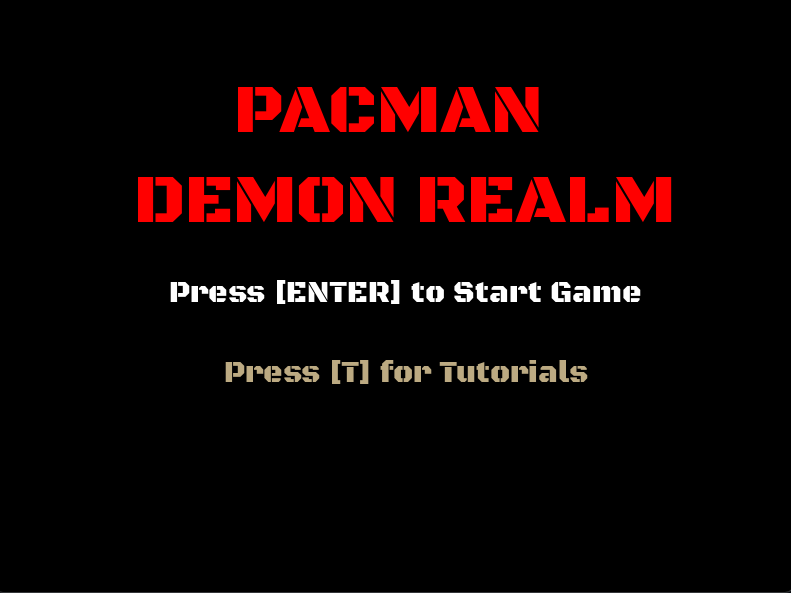
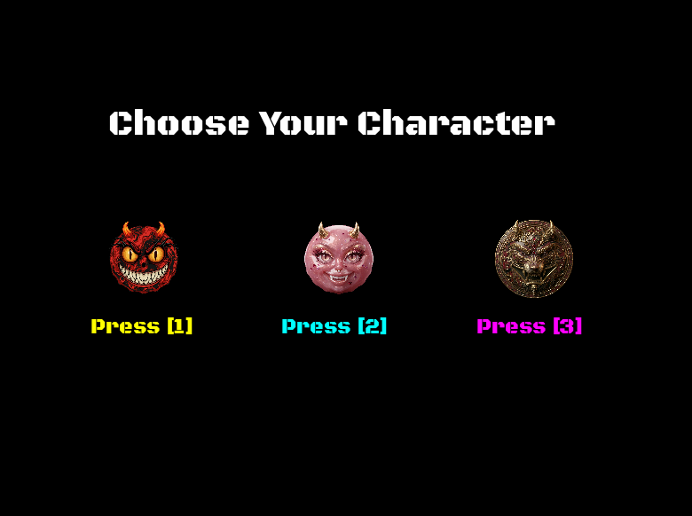
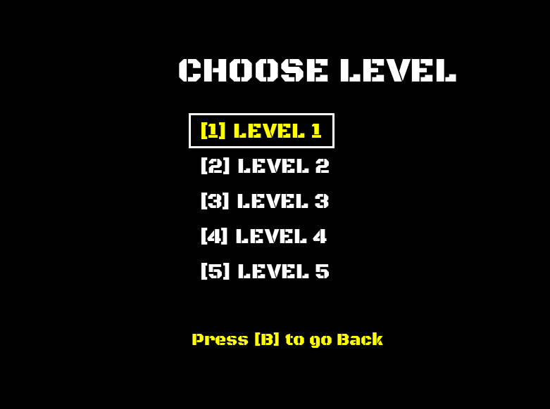
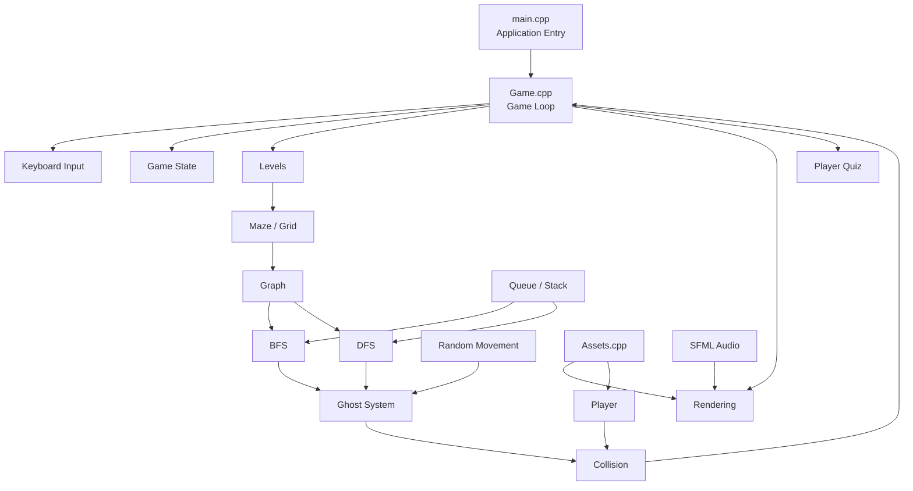
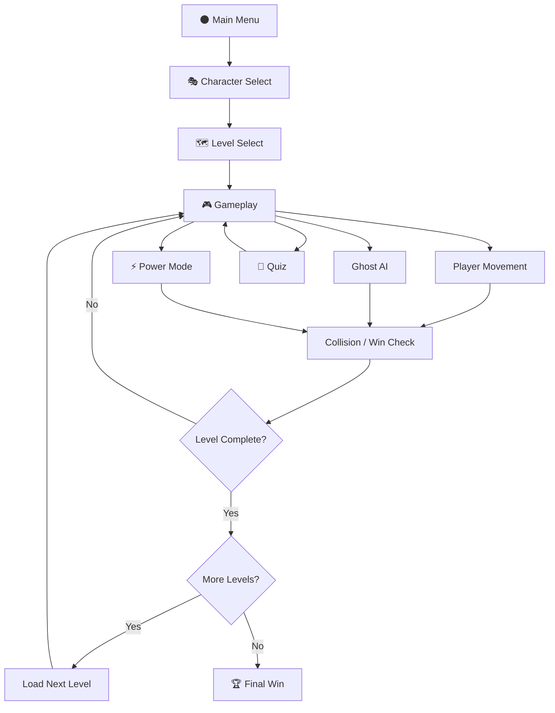
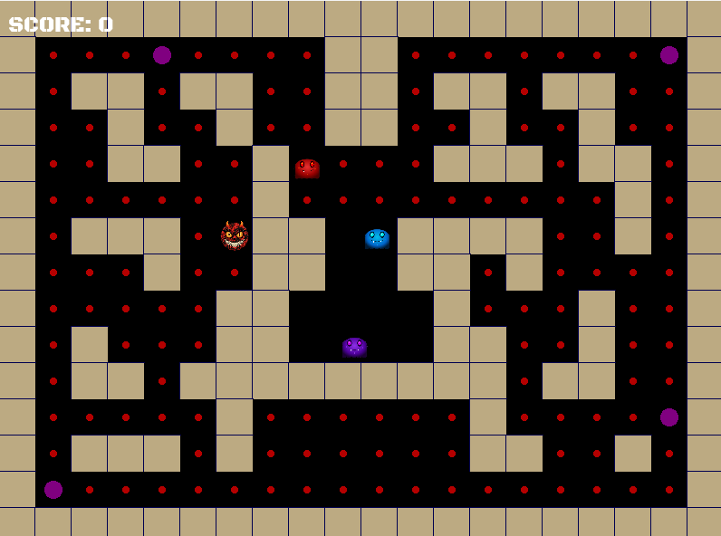
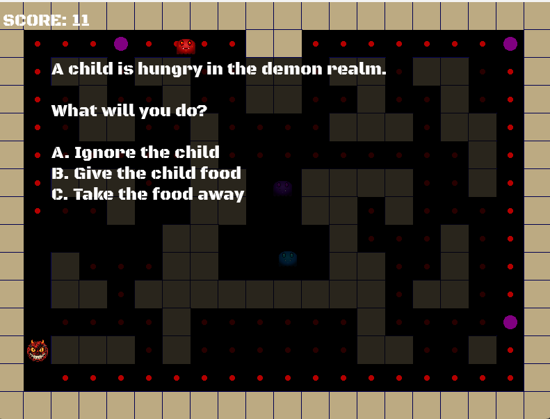
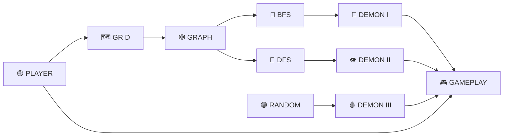

<div align="center">

<br>

# 👹 PACMAN — DEMON REALM

### `ENTER THE REALM • SURVIVE THE MAZE • OUTSMART THE DEMONS`

<br>



<br>
<br>

[](https://isocpp.org/)
[](https://www.sfml-dev.org/)
[](#-the-demon-engine)
[](#-project-architecture)
[](https://github.com/syedazfarabbas235/Pacman-Game)

<br>

### 🌑 `THE MAZE IS ALIVE.`

### 👹 `THE DEMONS ARE HUNTING.`

### 🧠 `THE ALGORITHMS ARE WATCHING.`

<br>

</div>

---

<div align="center">

# ⚔️ THE DEMON REALM AWAKENS

</div>

> **Pacman — Demon Realm** is a C++ and SFML-based maze game that combines real-time gameplay with Data Structures and Algorithms.
>
> The familiar Pacman-style experience is transformed into a dark supernatural realm where different demons use different movement strategies, while the maze itself becomes a graph that can be explored using algorithms such as **BFS and DFS**.

The project is built around the idea of turning **DSA concepts into actual gameplay mechanics**.

Instead of implementing algorithms as isolated classroom exercises:

```text
                    THEORY
                      │
                      ▼
             DATA STRUCTURES
                      │
                      ▼
                ALGORITHMS
                      │
                      ▼
               GAME SYSTEMS
                      │
                      ▼
              ENEMY BEHAVIOR
                      │
                      ▼
             PLAYER EXPERIENCE
```

<div align="center">

### 🎮 A PLAYABLE GAME

**+**

### 🧠 A DSA IMPLEMENTATION

**+**

### 👹 AN ALGORITHMIC ENEMY SYSTEM

</div>

---

# 🩸 TABLE OF CONTENTS

<details>
<summary><b>☠️ Open the Demon Codex</b></summary>

<br>

- [🌑 The Demon Realm](#-the-demon-realm)
- [🎮 Gameplay](#-gameplay)
- [👹 Demon Codex](#-demon-codex)
- [🧠 The Demon Engine](#-the-demon-engine)
- [🕸️ Maze as a Graph](#️-maze-as-a-graph)
- [🔵 BFS Pathfinder](#-bfs-pathfinder)
- [🔴 DFS Explorer](#-dfs-explorer)
- [🎲 Random Demon](#-random-demon)
- [📦 Queue System](#-queue-system)
- [📚 Stack System](#-stack-system)
- [⚡ Power Mode](#-power-mode)
- [🧩 Quiz System](#-quiz-system)
- [🏆 Score System](#-score-system)
- [💀 Collision & Game Over](#-collision--game-over)
- [🗺️ Level System](#️-level-system)
- [🎭 Character Selection](#-character-selection)
- [🎛️ Game States](#️-game-states)
- [🏰 Project Architecture](#-project-architecture)
- [🔄 Game Loop](#-game-loop)
- [🧭 Gameplay Flow](#-gameplay-flow)
- [🎮 Controls](#-controls)
- [🔊 Audio & Rendering](#-audio--rendering)
- [📂 Project Structure](#-project-structure)
- [🧠 DSA → Gameplay](#-dsa--gameplay)
- [📊 Complexity](#-complexity)
- [🛠️ Technology Stack](#️-technology-stack)
- [⚙️ Installation](#️-installation)
- [📸 Screenshot Gallery](#-screenshot-gallery)
- [🎥 Enter the Realm](#-enter-the-realm)
- [📚 Learning Outcomes](#-learning-outcomes)
- [👤 Credits](#-credits)
- [🌑 Final Transmission](#-final-transmission)

</details>

---

# 🌑 THE DEMON REALM

<div align="center">

<table>
<tr>

<td align="center" width="33%">

# 👹

### DEMONS

Different enemies use different movement strategies.

</td>

<td align="center" width="33%">

# 🧠

### ALGORITHMS

BFS, DFS, graphs, queues and stacks influence gameplay.

</td>

<td align="center" width="33%">

# 🎮

### GAMEPLAY

Real-time movement, levels, quizzes, power mode and scoring.

</td>

</tr>
</table>

</div>

---

## 🏯 What is the game?

**Pacman — Demon Realm** is a grid-based maze game developed in **C++ using SFML 3.1**.

The player enters a dark realm filled with:

- 🗺️ Maze paths
- 👹 Multiple demons
- ⚡ Power cells
- 🧩 Interactive quizzes
- 🏆 Score tracking
- 🎭 Character selection
- 🗺️ Multiple levels
- 🔊 Sound effects
- 🎵 Background music

But underneath the visual game is a DSA-based system.

The maze is represented through a grid and graph-related structures, while different demons use different movement techniques.

---

# 🎮 GAMEPLAY

<div align="center">


<br>

### `WELCOME TO THE DEMON REALM`

</div>

---

## 🌑 Enter the Maze

The game starts with a Demon Realm themed menu.

```text
╔════════════════════════════════════════════════════╗
║                                                    ║
║                  PACMAN                            ║
║                                                    ║
║               DEMON REALM                          ║
║                                                    ║
║          Press [ENTER] to Start Game              ║
║                                                    ║
║             Press [T] for Tutorials               ║
║                                                    ║
╚════════════════════════════════════════════════════╝
```

The player can enter the tutorial or begin the game.

---

# 🎭 CHARACTER SELECTION

Before entering the maze, the player can select a playable character.

<div align="center">



</div>

The selected character texture is then used for the player sprite during gameplay.

---

# 🗺️ LEVEL SELECTION

The game contains a dedicated level-selection interface.

Players can choose a level before entering the maze.

```text
                    LEVEL SELECT

                  ┌─────────────┐
                  │   LEVEL 1   │
                  └─────────────┘

                  ┌─────────────┐
                  │   LEVEL 2   │
                  └─────────────┘

                  ┌─────────────┐
                  │   LEVEL 3   │
                  └─────────────┘

                  ┌─────────────┐
                  │   LEVEL 4   │
                  └─────────────┘

                  ┌─────────────┐
                  │   LEVEL 5   │
                  └─────────────┘
```

The currently selected level is highlighted using the selection interface.

After confirming with **ENTER**, the selected level is loaded.

---

<div align="center">



</div>

---

# 👹 DEMON CODEX

<div align="center">

# `THE THREE HUNTERS`

</div>

The enemies are designed with different movement behaviors.

This is one of the main places where the game's DSA concepts become visible during gameplay.

---

## 🔵 DEMON I — THE PATHFINDER

### `BFS`

```text
        👹
         │
         ▼
      SEARCH
         │
         ▼
   ┌─────┴─────┐
   ▼           ▼
 NODE         NODE
   │           │
   └─────┬─────┘
         ▼
       PLAYER
```

The BFS-based demon searches the graph level-by-level.

This makes BFS useful for movement decisions based on the maze structure.

### Algorithm

```text
Breadth-First Search
```

### Purpose

```text
Explore reachable nodes level-by-level
```

### Complexity

```text
O(V + E)
```

---

## 🔴 DEMON II — THE EXPLORER

### `DFS`

The DFS-based demon uses depth-first traversal.

```text
START
  │
  ▼
 NODE
  │
  ├────────► NODE
  │            │
  │            └────► NODE
  │
  └────────► NODE
```

DFS follows a path deeper before backtracking.

### Algorithm

```text
Depth-First Search
```

### Purpose

```text
Maze traversal / exploration
```

### Complexity

```text
O(V + E)
```

---

## 🟣 DEMON III — THE WANDERER

### `RANDOM MOVEMENT`

The third ghost follows randomized movement behavior.

This produces a different enemy pattern from the graph-based demons.

```text
             👹
              │
       ┌──────┼──────┐
       ▼      ▼      ▼
      UP    LEFT    RIGHT
       │      │      │
       └──────┼──────┘
              ▼
           RANDOM
```

The combination of deterministic and randomized movement makes the enemy system more varied.

---

# 🧠 THE DEMON ENGINE

<div align="center">

# `DATA STRUCTURES + ALGORITHMS = GAMEPLAY`

</div>

The core technical idea of the project is:

```text
                         MAZE
                          │
                          ▼
                         GRID
                          │
                          ▼
                        GRAPH
                          │
              ┌───────────┴───────────┐
              │                       │
              ▼                       ▼
             BFS                     DFS
              │                       │
              ▼                       ▼
          DEMON I                  DEMON II
              │                       │
              └───────────┬───────────┘
                          │
                          ▼
                    GAMEPLAY AI
```

The project contains custom implementations of:

```text
🕸️ Graph
📦 Queue
📚 Stack
🔗 Node-based structures
🔵 BFS
🔴 DFS
```

---

# 🕸️ MAZE AS A GRAPH

The maze is represented as a grid.

A simplified representation looks like:

```text
        ●──────●──────●
        │      │      │
        │      │      │
        ●──────●──────●
        │      │      │
        │      │      │
        ●──────●──────●
```

Each traversable location can be treated as a node.

Connections between neighboring cells represent possible movement.

This gives the AI algorithms a structure to traverse.

---

## 🧭 Graph Concept

```text
GRID CELL
   │
   ▼
 GRAPH NODE
   │
   ├──── Neighbor
   ├──── Neighbor
   ├──── Neighbor
   └──── Neighbor
```

The project includes a dedicated:

```text
Graphs.cpp
```

for graph-related functionality.

---

# 🔵 BFS PATHFINDING

BFS works by exploring nodes in layers.

```text
LEVEL 0

        ●
        │
LEVEL 1

    ●───●───●
        │

LEVEL 2

    ●   ●   ●
    │   │   │

LEVEL 3

    ●───●───●
```

The search progresses outward from its starting point.

This is useful for graph-based movement because the algorithm systematically explores the available maze nodes.

---

## BFS ENGINE

```text
START
  │
  ▼
ENQUEUE
  │
  ▼
VISIT NODE
  │
  ▼
CHECK NEIGHBORS
  │
  ▼
ENQUEUE UNVISITED
  │
  ▼
REPEAT
```

The BFS implementation works together with the queue system.

---

# 📦 QUEUE SYSTEM

BFS requires a queue.

The project contains a custom queue implementation.

```text
                QUEUE

 FRONT                             REAR
   │                                 │
   ▼                                 ▼

┌──────┐  ┌──────┐  ┌──────┐  ┌──────┐
│  A   │→ │  B   │→ │  C   │→ │  D   │
└──────┘  └──────┘  └──────┘  └──────┘
   │                                 │
   ▼                                 ▼
DEQUEUE                           ENQUEUE
```

The queue helps maintain the BFS traversal order.

---

# 🔴 DFS TRAVERSAL

DFS explores deeper before returning.

```text
START
  │
  ▼
  A
  │
  ▼
  B
  │
  ▼
  C
  │
  ▼
  D
  │
  ▼
BACKTRACK
```

DFS is supported by stack-based traversal logic.

---

# 📚 STACK SYSTEM

The project contains a custom stack structure.

```text
          TOP
           │
           ▼
       ┌───────┐
       │   D   │
       ├───────┤
       │   C   │
       ├───────┤
       │   B   │
       ├───────┤
       │   A   │
       └───────┘
```

The stack stores traversal information used by depth-first logic.

---

# 🔗 NODE-BASED STRUCTURES

The project uses node-based structures for its custom data structures.

Conceptually:

```text
┌──────────┐       ┌──────────┐
│  NODE A  │──────►│  NODE B  │──────► ...
└──────────┘       └──────────┘
```

These structures provide the foundation for:

- Queue nodes
- Stack nodes
- Graph-related nodes

---

# ⚡ POWER MODE

Special maze cells are represented separately from ordinary maze cells.

The game maintains a:

```text
powerMode
```

state and uses an SFML clock for timing.

```text
           NORMAL
              │
              ▼
         ⚡ POWER CELL
              │
              ▼
         POWER MODE
              │
              ▼
         TIMER EXPIRES
              │
              ▼
           NORMAL
```

This creates another gameplay state that interacts with the enemy system.

---

# 🧩 THE DEMON QUIZ

The Demon Realm isn't only about movement.

The game also contains an interactive quiz system.

When the quiz becomes active, normal gameplay movement is stopped while the player answers.

```text
╔══════════════════════════════════════════╗
║              👁️ DEMON QUIZ               ║
╠══════════════════════════════════════════╣
║                                          ║
║   A mysterious situation appears...      ║
║                                          ║
║   A. Choice One                          ║
║                                          ║
║   B. Choice Two                          ║
║                                          ║
║   C. Choice Three                        ║
║                                          ║
║       PRESS A / B / C                    ║
║                                          ║
╚══════════════════════════════════════════╝
```

The quiz system is handled separately through:

```text
PlayerQuiz.cpp
```

while interacting with the overall game state.

---

# 🏆 SCORE

The game maintains a live score value.

During rendering, the score is displayed to the player.

```text
╔══════════════════════╗
║      SCORE: 120      ║
╚══════════════════════╝
```

The score is part of the overall gameplay state.

---

# 💀 COLLISION & GAME OVER

The game continuously checks the player's position against active ghosts.

Conceptually:

```text
              PLAYER
                 │
                 ▼
          COLLISION CHECK
                 │
        ┌────────┴────────┐
        │                 │
        ▼                 ▼
    NO COLLISION       COLLISION
        │                 │
        ▼                 ▼
    CONTINUE          GAME OVER
```

Ghosts that are in their return state are handled separately from active ghost collisions.

The game also contains a final win state.

---

# 🗺️ LEVEL SYSTEM

The project contains multiple levels.

```text
┌─────────┐
│ LEVEL 1 │
└────┬────┘
     │
     ▼
┌─────────┐
│ LEVEL 2 │
└────┬────┘
     │
     ▼
┌─────────┐
│ LEVEL 3 │
└────┬────┘
     │
     ▼
┌─────────┐
│ LEVEL 4 │
└────┬────┘
     │
     ▼
┌─────────┐
│ LEVEL 5 │
└─────────┘
```

The player can also enter the level-selection interface and choose a specific level.

Level management is separated into:

```text
Levels.cpp
```

This keeps level-loading logic away from the main application entry point.

---

# 🎭 CHARACTER SYSTEM

The project contains three character textures.

```text
CHARACTER 1
CHARACTER 2
CHARACTER 3
```

The selected texture is assigned to the Pacman sprite before gameplay begins.

```text
Character Selection
        │
        ▼
Selected Character
        │
        ▼
Pacman Texture
        │
        ▼
Pacman Sprite
        │
        ▼
Gameplay
```

---

# 🎛️ GAME STATES

The game uses different states for different interfaces.

```text
                         MENU
                          │
              ┌───────────┴───────────┐
              ▼                       ▼
          TUTORIAL            CHARACTER SELECT
                                      │
                                      ▼
                                LEVEL SELECT
                                      │
                                      ▼
                                   PLAYING
                                      │
                         ┌────────────┼────────────┐
                         ▼            ▼            ▼
                       QUIZ       GAME OVER       WIN
```

This state-based structure keeps the game's different screens separated.

---

# 🏰 PROJECT ARCHITECTURE



---

# 🔄 THE GAME LOOP

At the heart of the game is the main application loop.

```text
┌─────────────────────────────┐
│       CREATE WINDOW         │
└──────────────┬──────────────┘
               ▼
┌─────────────────────────────┐
│        LOAD ASSETS           │
└──────────────┬──────────────┘
               ▼
┌─────────────────────────────┐
│         LOAD LEVEL           │
└──────────────┬──────────────┘
               ▼
        ┌───────────────┐
        │   GAME LOOP   │◄───────────────┐
        └───────┬───────┘                │
                ▼                         │
        HANDLE EVENTS                    │
                │                         │
                ▼                         │
          UPDATE LOGIC                   │
                │                         │
                ▼                         │
        PLAYER MOVEMENT                  │
                │                         │
                ▼                         │
          GHOST MOVEMENT                 │
                │                         │
                ▼                         │
        COLLISION / WIN                 │
                │                         │
                ▼                         │
            RENDER                      │
                │                         │
                └─────────────────────────┘
```

---

# 🧭 GAMEPLAY FLOW



---

# 🎮 CONTROLS

<div align="center">

| 🎮 KEY | ACTION |
|:---:|:---|
| `W` | Move Up |
| `S` | Move Down |
| `A` | Move Left |
| `D` | Move Right |
| `1` | Select Level 1 |
| `2` | Select Level 2 |
| `3` | Select Level 3 |
| `4` | Select Level 4 |
| `5` | Select Level 5 |
| `ENTER` | Confirm / Start |
| `T` | Open Tutorial |
| `B` | Go Back |
| `A / B / C` | Answer Quiz |

</div>

---

# 🕹️ PLAYER MOVEMENT

The player maintains both grid coordinates and pixel coordinates.

```text
pacmanRow
pacmanCol

     ↓

Grid Position

     ↓

pacmanX
pacmanY

     ↓

Screen Position
```

The player also maintains:

```text
Current Direction
        +
Next Direction
```

This allows keyboard input to set the intended movement direction while gameplay logic handles the actual movement.

---

# 👹 GHOST ARCHITECTURE

Each ghost maintains its own position.

```text
                 GHOST SYSTEM
                      │
       ┌──────────────┼──────────────┐
       ▼              ▼              ▼
    GHOST 1        GHOST 2        GHOST 3
       │              │              │
       ▼              ▼              ▼
      BFS            DFS           RANDOM
```

The ghost system also contains animation and return-state handling.

---

# 🔊 AUDIO SYSTEM

The game integrates SFML audio.

The project contains sound resources for gameplay events such as:

```text
🔵 Dot Sound
⚡ Power Sound
💀 Death Sound
🎵 Background Music
```

The game uses:

```text
sf::SoundBuffer
sf::Sound
sf::Music
```

for its audio system.

---

# 🎨 RENDERING SYSTEM

SFML handles the visual presentation of the game.

The rendering system draws:

```text
🗺️ Maze
👹 Ghosts
🟡 Player
🧩 Quiz
🏆 Score
🎭 Character Selection
🗺️ Level Selection
💀 Game Over
🏆 Final Win
```

The game also uses SFML text, sprites, textures and shapes for its interfaces.

---

# 📂 PROJECT STRUCTURE

```text
Pacman-Game/
│
├── 📄 Game.h
│
├── ⚙️ Ai.cpp
├── 🎨 Assets.cpp
├── 🎮 Game.cpp
├── 🌐 GameData.cpp
├── 👹 Ghosts.cpp
├── 🕸️ Graphs.cpp
├── 🗺️ Levels.cpp
├── 🚀 main.cpp
├── 🧩 PlayerQuiz.cpp
├── 📦 QueueStack.cpp
│
├── 📁 assets/
│   ├── hero.png
│   ├── menu.png
│   ├── character-select.png
│   ├── level-select.png
│   ├── gameplay.png
│   ├── gameplay.gif
│   └── quiz.png
│
└── 📄 README.md
```

---

# 🧩 SOURCE FILE MAP

<div align="center">

| FILE | ROLE |
|:---|:---|
| `Game.h` | Shared declarations, structures and constants |
| `main.cpp` | Creates the window and runs the application |
| `Game.cpp` | Game state, input, update and rendering |
| `GameData.cpp` | Global game data, maze, player, ghosts and resources |
| `Levels.cpp` | Level loading and level management |
| `Ai.cpp` | AI and pathfinding functionality |
| `Ghosts.cpp` | Ghost movement and behavior |
| `Graphs.cpp` | Graph construction and management |
| `QueueStack.cpp` | Queue and stack implementation |
| `PlayerQuiz.cpp` | Quiz functionality |
| `Assets.cpp` | Asset loading, player movement and animation |

</div>

---

# 🧠 DSA → GAMEPLAY

<div align="center">

| 🧠 DSA | 🎮 GAME IMPLEMENTATION | 👁️ RESULT |
|:---|:---|:---|
| **Graph** | Maze representation | Gives the maze a traversable structure |
| **BFS** | Demon pathfinding | Algorithmic movement |
| **DFS** | Demon traversal | Exploration-based movement |
| **Queue** | BFS traversal | Controls search order |
| **Stack** | DFS traversal | Supports depth-first exploration |
| **Nodes** | Custom structures | Stores connected data |
| **Grid** | Maze | Defines movement space |

</div>

---

# 📊 ALGORITHM COMPLEXITY

For a graph containing:

```text
V = vertices / nodes

E = edges / connections
```

the standard traversal complexity is:

| Algorithm | Complexity | Usage |
|:---|:---:|:---|
| 🔵 BFS | `O(V + E)` | Ghost pathfinding |
| 🔴 DFS | `O(V + E)` | Ghost traversal |
| 📦 Queue | `O(1)` basic operations | BFS support |
| 📚 Stack | `O(1)` basic operations | DFS support |

The actual gameplay workload depends on the size and structure of the maze.

---

# ⚙️ TECHNOLOGY STACK

<div align="center">

## 💻 LANGUAGE

[](https://isocpp.org/)

<br>

## 🎮 GAME FRAMEWORK

[](https://www.sfml-dev.org/)

<br>

## 🧠 COMPUTER SCIENCE


<br>

## 🛠️ DEVELOPMENT


</div>

---

# ⚙️ INSTALLATION

## 1️⃣ Clone the repository

```bash
git clone https://github.com/syedazfarabbas235/Pacman-Game.git
```

Then:

```bash
cd Pacman-Game
```

---

## 2️⃣ Requirements

The project uses:

```text
C++
SFML 3.1
Visual Studio
Windows
```

Make sure SFML 3.1 is correctly configured for your Visual Studio environment.

---

## 3️⃣ Open the project

Open the Visual Studio project/solution.

Make sure the SFML:

```text
Include Directories
Library Directories
Linker Dependencies
Runtime DLLs
```

are configured correctly for your environment.

---

## 4️⃣ Build

In Visual Studio:

```text
Build
   ↓
Build Solution
```

or:

```text
Ctrl + Shift + B
```

---

## 5️⃣ Run

Run the project with:

```text
F5
```

or:

```text
Ctrl + F5
```

---

# 🖼️ SCREENSHOT GALLERY

<div align="center">

# 🌑 THE REALM


### `THE GATES ARE OPEN.`

<br>

---

# 🎭 THE CHOSEN ONE


### `CHOOSE YOUR FORM.`

<br>

---

# 🗺️ THE MAZE


### `CHOOSE YOUR DESTINATION.`

<br>

---

# 👹 THE HUNT



### `THE DEMONS ARE AWAKE.`

<br>

---

# 🧩 THE TEST



### `EVEN THE REALM HAS QUESTIONS.`

</div>

---

# 🎥 ENTER THE REALM

<div align="center">

## `WATCH THE MAZE COME ALIVE`


<br>

### 🎮 MOVE

↓

### 👹 SURVIVE

↓

### 🧠 OUTSMART

↓

### ⚡ POWER UP

↓

### 🏆 CLEAR THE LEVEL

</div>

---

# 🧬 SYSTEM OVERVIEW

```text
                         ┌─────────────────┐
                         │    MAIN.CPP     │
                         │ Application     │
                         │ Entry Point     │
                         └────────┬────────┘
                                  │
                                  ▼
                         ┌─────────────────┐
                         │    GAME.CPP     │
                         │ Game Controller │
                         └────────┬────────┘
                                  │
             ┌────────────────────┼────────────────────┐
             │                    │                    │
             ▼                    ▼                    ▼
      ┌────────────┐       ┌────────────┐      ┌────────────┐
      │   PLAYER   │       │   GHOSTS   │      │   LEVELS   │
      └─────┬──────┘       └─────┬──────┘      └─────┬──────┘
            │                    │                    │
            │                    ▼                    ▼
            │             ┌─────────────┐      ┌─────────────┐
            │             │     AI      │      │    MAZE     │
            │             └──────┬──────┘      └──────┬──────┘
            │                    │                    │
            │             ┌──────┴──────┐             │
            │             ▼             ▼             ▼
            │            BFS           DFS           GRAPH
            │             │             │             │
            │             ▼             ▼             │
            │          QUEUE          STACK            │
            │             │             │             │
            └─────────────┴─────────────┴─────────────┘
                                  │
                                  ▼
                         ┌─────────────────┐
                         │    GAMEPLAY    │
                         └─────────────────┘
```

---

# 🔥 FROM ALGORITHM TO ACTION

<div align="center">

```text
┌───────────────────────────────────────────────┐
│                                               │
│                  🕸️ GRAPH                     │
│                     │                         │
│                     ▼                         │
│              🧠 ALGORITHM                     │
│                     │                         │
│          ┌──────────┴──────────┐              │
│          ▼                     ▼              │
│         BFS                   DFS             │
│          │                     │              │
│          ▼                     ▼              │
│       DEMON 1              DEMON 2            │
│          │                     │              │
│          └──────────┬──────────┘              │
│                     ▼                         │
│               👹 ENEMY AI                     │
│                     │                         │
│                     ▼                         │
│              🎮 GAMEPLAY                      │
│                                               │
└───────────────────────────────────────────────┘
```

</div>

---

# 📚 LEARNING OUTCOMES

This project demonstrates practical experience with:

### 💻 Programming

- C++
- Modular source-file organization
- Real-time application loops
- Input handling

### 🧠 Data Structures

- Graphs
- Nodes
- Queues
- Stacks
- Grid-based representations

### 🔬 Algorithms

- Breadth-First Search
- Depth-First Search
- Graph traversal
- Randomized movement logic

### 🎮 Game Development

- SFML rendering
- Sprites
- Text interfaces
- Keyboard controls
- Game states
- Collision detection
- Level management
- Character selection
- Quiz interaction
- Score handling
- Power mode
- Audio integration

---

# 🎯 WHY DSA IN A GAME?

A major goal of the project is to demonstrate that Data Structures and Algorithms are not limited to theoretical exercises.

Consider the difference:

```text
CLASSROOM
────────────

"Implement BFS."

        ↓

Program prints traversal.


GAME
────

"Implement BFS."

        ↓

Maze becomes a graph.

        ↓

BFS searches the graph.

        ↓

Demon uses the algorithm.

        ↓

Demon moves through the maze.

        ↓

PLAYER REACTS.
```

The algorithm becomes something the player can actually **see and experience**.

---

# 🧠 THE PROJECT IN ONE DIAGRAM



---

# 🌌 THE DEMON REALM EXPERIENCE

<div align="center">

<table>
<tr>

<td width="25%" align="center">

## 🌑

### DARK MAZE

Navigate the Demon Realm.

</td>

<td width="25%" align="center">

## 👹

### HUNTERS

Face multiple enemy behaviors.

</td>

<td width="25%" align="center">

## 🧠

### DSA

Algorithms drive gameplay.

</td>

<td width="25%" align="center">

## ⚡

### POWER

Use special maze elements.

</td>

</tr>
</table>

</div>

---

# 📜 PROJECT IDENTITY

```text
╔══════════════════════════════════════════════════════╗
║                                                      ║
║                 PACMAN — DEMON REALM                ║
║                                                      ║
║   Language       C++                                 ║
║   Framework      SFML 3.1                            ║
║   Genre          Maze / Arcade                       ║
║   Theme          Dark Supernatural / Demon Realm     ║
║                                                      ║
║   Core DSA       Graph                                ║
║                  BFS                                  ║
║                  DFS                                  ║
║                  Queue                                ║
║                  Stack                                ║
║                  Node Structures                      ║
║                                                      ║
║   Gameplay       Multiple Levels                     ║
║                  Ghost AI                             ║
║                  Power Mode                           ║
║                  Quiz System                          ║
║                  Character Selection                  ║
║                  Score System                         ║
║                                                      ║
╚══════════════════════════════════════════════════════╝
```

---

# 👤 CREDITS

<div align="center">

## PACMAN — DEMON REALM

### Developed by **Syed Azfar Abbas**

<br>

**C++**

**SFML 3.1**

**Data Structures**

**Algorithms**

**Object-Oriented Programming**

**Game Development**

<br>

[](https://github.com/syedazfarabbas235/Pacman-Game)

</div>

---

# 🌑 FINAL TRANSMISSION

<div align="center">

<br>

# 👹 THE REALM IS WAITING.

<br>

```text
                 ╔══════════════════════╗
                 ║                      ║
                 ║    ENTER THE MAZE    ║
                 ║          ↓           ║
                 ║     FACE THE DEMONS  ║
                 ║          ↓           ║
                 ║     OUTSMART THE AI  ║
                 ║          ↓           ║
                 ║      MASTER THE DSA  ║
                 ║          ↓           ║
                 ║        SURVIVE       ║
                 ║                      ║
                 ╚══════════════════════╝
```

<br>

# 🌑 ENTER THE REALM.

## 👹 OUTSMART THE DEMONS.

## 🧠 MASTER THE ALGORITHMS.

## 🎮 SURVIVE THE MAZE.

<br>

---

### `BUILT WITH C++ • SFML 3.1 • DATA STRUCTURES • ALGORITHMS`

<br>

⭐ **If you enjoyed exploring the project, consider starring the repository.**

<br>

[](https://github.com/syedazfarabbas235/Pacman-Game)

<br>

</div>
